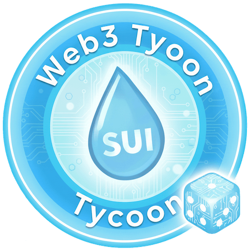
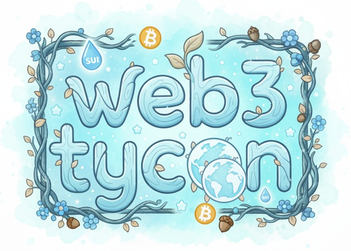

# Web3 Tycoon

> 基于 Sui 区块链的全链上 3D 大富翁游戏

🌐 **在线体验**: [www.web3tycoon.com](https://www.web3tycoon.com) | [Walrus 去中心化版本](https://web3tycoon.wal.app/)

## 🎯 项目概述

Web3 Tycoon 是一款 **完全链上的 3D 大富翁游戏**，将经典桌游玩法与 Sui 区块链技术深度融合。所有游戏逻辑运行在 Move 智能合约中，确保公平透明。玩家在 Web3 主题的虚拟世界中投资地产、收集卡牌、体验 DeFi 机制，在游戏中学习区块链知识。

**核心特色：**
- ⛓️ **完全链上游戏逻辑** - 所有游戏状态和规则由 Move 智能合约管理
- 🎲 **经典大富翁玩法** - 投资地产、收取租金、策略决策
- 🔐 **Sui 原生随机数** - 使用 Sui Random 对象确保公平性
- 🌐 **去中心化部署** - Cloudflare Pages + Walrus Sites 双重部署

## 🎮 游戏特色

- 🎲 **经典大富翁玩法** - 掷骰子、买地产、收租金、策略决策
- ⛓️ **完全链上逻辑** - 所有游戏规则在 Move 智能合约中执行
- 🎨 **体素风格 3D** - Cocos Creator 3D 引擎 + Minecraft 风格渲染(demo阶段)
- 🌍 **Web3 主题世界** - defi、交易等 Web3 主题玩法
- 🎴 **卡牌系统** - 机会卡、技能卡影响游戏走向
- 🎲 **公平随机** - 使用 Sui 原生随机数确保公平性

## 🚀 快速开始

### 环境要求
- **Sui CLI** (最新版)
- **Cocos Creator** 3.8.7

### 开发指南

详细的开发、构建和部署步骤请查看：

- 📖 [客户端开发指南](docs/tech/client-development.md)
- 🔗 [Move 合约开发](move/tycoon/README.md)
- 🎨 [AIGC 资源生成](tools/asset-generator/README.md)
- 🚀 [部署指南](docs/DEPLOYMENT.md)

## 📚 文档

- 🎮 [游戏机制设计](docs/design/game-analysis.md) - 大富翁玩法拆解与 DeFi 集成
- 🏗️ [技术架构](docs/tech/architecture.md) - 系统架构与核心组件
- 🔗 [Sui 区块链集成](docs/tech/sui-integration.md) - Move 合约与客户端对齐
- 📦 [项目结构](docs/project-structure.md) - 文件组织与代码规范

## 🎯 技术亮点

### 完全链上的 3D 游戏
- **所有游戏逻辑在链上**：Move 智能合约实现完整游戏规则
- **客户端仅负责渲染**：3D 客户端作为状态展示层
- **事件驱动同步**：通过 Sui 事件实现状态同步
- **可验证性**：所有操作可审计和重放

### TypeScript 与 Move 深度对齐
- TS 类型定义与 Move 合约结构一致
- 客户端寻路算法匹配链上逻辑节省gas
- 完整的事件索引和状态恢复系统
- Wallet Standard 标准钱包接入

### 去中心化部署
- Cloudflare Pages（全球 CDN + 自动部署）
- Walrus Sites（去中心化存储备份）

## 🏆 项目状态

✅ **已完成**
- Move 智能合约（地产、卡牌、Buff、随机数）
- 事件驱动架构（聚合事件 + 状态同步）
- 3D 客户端（Cocos Creator + 体素渲染）
- 地图编辑器 (玩家可以自己编辑地图发布)
- 双重部署（Cloudflare Pages + Walrus Sites）

🚧 **进行中/TODO**
- 美术资源，UI资源，场景，动画等
- AIGC 资源
- 更多卡牌和建筑功能
- 地图发布者奖励
- defi，价格预测玩法的集成
-

## 🤝 参与贡献

欢迎参与项目开发！可以通过 GitHub Issues 报告 Bug、提出功能建议或提交代码改进。

详细开发规范请参考：[项目结构文档](docs/project-structure.md)

## 📄 许可证

Apache-2.0 License

---

**在游戏中学习 Web3，在 DeFi 中获得乐趣！**

[开始游戏](https://www.web3tycoon.com) • [Walrus 去中心化版本](https://web3tycoon.wal.app/) • [查看文档](docs/) • [智能合约](move/tycoon/)

Made with ❤️ by Web3 Tycoon Team

**License**: Apache-2.0

