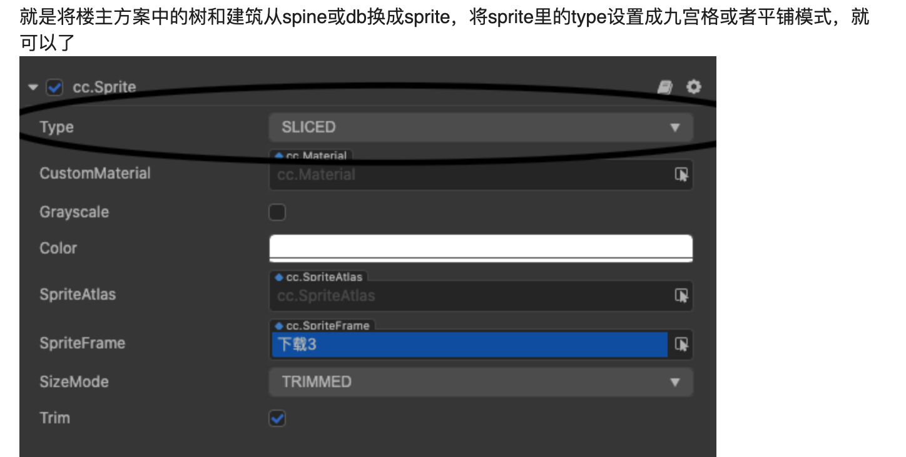

相机这个默认值非常好，方便往原点放测试的东西

摄像机视角的有趣玩法，实现《饥荒》同款视觉表现，一毛一样
（八方旅人和饥荒的游戏视觉呈现非常有趣，你能清楚的知道它是2D素材，却呈现出一种3D世界的感觉，这种2D和3D混合的游戏，在游戏历史中，很早就有出现，比如轩辕伏魔录、空之轨迹、仙境传说等等）
https://forum.cocos.org/t/topic/124531

注意：
评论区的这个方案更好，不要使用spine。

[chatgpt]
在 Cocos 里试三组欧拉角：
	1.	(45, 0, 0) → 单纯俯视 45°，但仍然正对 Z 轴。
	2.	(45, -45, 0) → 俯视 45° + 斜对角（大富翁棋盘效果）。
	3.	(26.565, -45, 0) → 暗黑破坏神效果。

（没测过）
2.5D视角游戏思路
https://forum.cocos.org/t/2-5d-demo/90433
