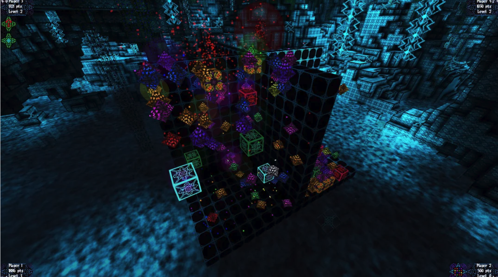
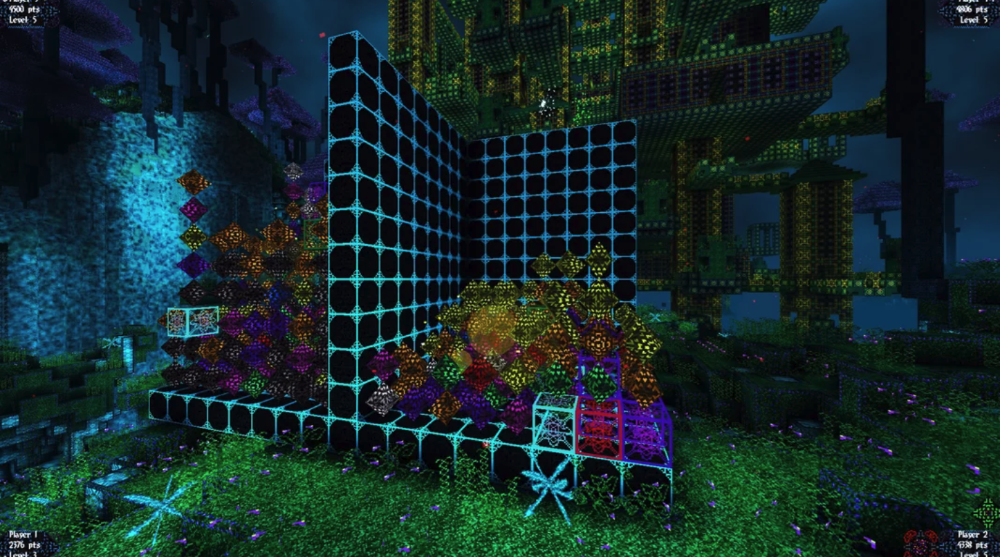

### 场景设计
（在铺好地图后，都是 不能破坏的block）
y=0，用来策划铺地图
y=1（或者更高一些）， 放玩家，房子，各种npc等模型，还有作为装饰的花花草草等

### todo list

- 使用minecraft的资源，构建一套block的渲染系统
（有足够种类的block，能生成不错的场景）
  1. 也就是生成 上面的 ‘场景设计’
  2. 每个block上都加上boxcollider （有控制开关： 在editor模式下需要， 实际游戏时不需要）

  重点，简化：
  参考
  

  

- 在上述系统里， 添加 大富翁游戏 专用方块类型
  1. 有个ui界面，列出所有方块（大富翁游戏 专用方块 罗列在前）
     选择了方块去铺地图
  2. 后续导出这些专用方块数据，就可以给move用了。

- 彩色体素光
  （实现相对简单，基本不需要资源； 对场景效果会有很大提升，不过这个后期有时间再做）

相对小，
估计face culling可能简单有效。

cocos不一定支持的，现在也用不到，先mark：
2D 纹理数组（texture2DArray） ？？？

参考：
Craft
Luanti
DivineVoxelEngine

这个效果看起来也不错
https://www.reddit.com/r/VoxelGameDev/comments/1amse5c/crystalline_bliss_first_game_published_made_with/?utm_source=chatgpt.com

Luanti 的资源包：
https://content.luanti.org/packages/awuuwa/default_textures_for_other_games/?utm_source=chatgpt.com