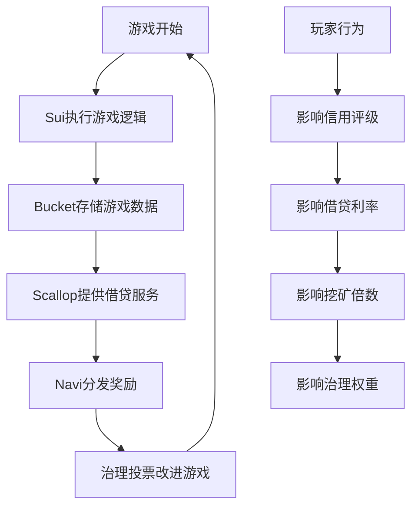

# 黑客松多赛道集成方案

## 赛道概述

根据黑客松要求，我们需要集成多个赛道来提高获奖概率：

1. **Sui赛道**（必选）- 主要区块链平台
2. **Bucket Protocol赛道** - 数据存储和管理
3. **Scallop Protocol赛道** - 借贷和流动性
4. **Navi Protocol赛道** - 流动性挖矿和治理

## 1. Sui赛道集成 🚀

### 核心功能
- 使用Sui区块链作为主要基础设施
- 所有游戏核心逻辑运行在Sui Move合约上
- 利用Sui的高性能和低Gas费特性

### 技术实现
```move
module tycoon::sui_core {
    use sui::object::{Self, UID};
    use sui::coin::{Self, Coin};
    use sui::sui::SUI;
    use sui::transfer;
    use sui::tx_context::{Self, TxContext};
    
    // 主游戏对象
    struct TycoonGame has key {
        id: UID,
        version: u64,
        total_players: u64,
        total_games: u64,
        treasury: Coin<SUI>
    }
    
    // 游戏会话
    struct GameSession has key, store {
        id: UID,
        players: vector<address>,
        start_time: u64,
        status: u8,
        pot: Coin<SUI>
    }
    
    // 创建新游戏
    public entry fun create_game(
        game: &mut TycoonGame,
        entry_fee: Coin<SUI>,
        ctx: &mut TxContext
    ) {
        let session = GameSession {
            id: object::new(ctx),
            players: vector::empty(),
            start_time: tx_context::epoch_timestamp_ms(ctx),
            status: 0, // waiting
            pot: entry_fee
        };
        
        transfer::share_object(session);
    }
}
```

### 创新点
- **对象所有权模型**：利用Sui独特的对象所有权系统管理游戏资产
- **并行处理**：多个游戏会话可以并行运行，无全局状态冲突
- **Move编程优势**：资源安全性确保游戏资产不会丢失或重复

## 2. Bucket Protocol集成 🪣

### 应用场景
Bucket Protocol提供去中心化数据存储解决方案，在我们的项目中用于：

1. **游戏历史记录存储**
2. **玩家统计数据管理**
3. **地图和配置数据存储**
4. **跨链数据同步**

### 技术实现
```move
module tycoon::bucket_integration {
    use bucket::storage::{Self, Bucket};
    use bucket::access_control::{Self, AccessControl};
    
    // 游戏数据桶
    struct GameDataBucket has key {
        id: UID,
        bucket: Bucket,
        access_control: AccessControl,
        data_types: vector<String>
    }
    
    // 存储游戏记录
    public fun store_game_record(
        bucket: &mut GameDataBucket,
        game_id: u64,
        game_data: vector<u8>,
        ctx: &mut TxContext
    ) {
        let key = b"game_record_";
        vector::append(&mut key, bcs::to_bytes(&game_id));
        
        storage::put(&mut bucket.bucket, key, game_data);
    }
    
    // 存储玩家统计
    public fun store_player_stats(
        bucket: &mut GameDataBucket,
        player: address,
        stats: PlayerStats,
        ctx: &mut TxContext
    ) {
        let key = b"player_stats_";
        vector::append(&mut key, bcs::to_bytes(&player));
        
        let serialized = bcs::to_bytes(&stats);
        storage::put(&mut bucket.bucket, key, serialized);
    }
}

// 玩家统计数据结构
struct PlayerStats has store {
    total_games: u64,
    wins: u64,
    total_earnings: u64,
    avg_game_duration: u64,
    favorite_strategy: String,
    achievements: vector<String>
}
```

### 创新应用
- **去中心化游戏记录**：所有游戏历史永久保存，无法篡改
- **跨设备数据同步**：玩家可以在任何设备上访问游戏记录
- **数据分析**：基于历史数据进行游戏平衡性分析
- **社区治理**：基于数据进行游戏规则投票

## 3. Scallop Protocol集成 🏦

### 应用场景
Scallop Protocol提供借贷服务，在游戏中创新性地实现：

1. **地产抵押贷款系统**
2. **流动性提供奖励**
3. **动态利率机制**
4. **风险管理系统**

### 技术实现
```move
module tycoon::scallop_integration {
    use scallop::lending_pool::{Self, LendingPool};
    use scallop::interest_model::{Self, InterestModel};
    
    // 地产抵押贷款
    struct PropertyMortgage has key, store {
        id: UID,
        borrower: address,
        property_nft_id: ID,
        loan_amount: u64,
        interest_rate: u64,
        start_time: u64,
        duration: u64,
        collateral_ratio: u64
    }
    
    // 抵押地产获得贷款
    public entry fun mortgage_property(
        property: &PropertyNFT,
        loan_amount: u64,
        duration: u64,
        pool: &mut LendingPool,
        ctx: &mut TxContext
    ): Coin<TYCO> {
        // 验证抵押率
        assert!(calculate_collateral_ratio(property, loan_amount) >= 150, 0);
        
        let mortgage = PropertyMortgage {
            id: object::new(ctx),
            borrower: tx_context::sender(ctx),
            property_nft_id: object::id(property),
            loan_amount,
            interest_rate: lending_pool::get_borrow_rate(pool),
            start_time: tx_context::epoch_timestamp_ms(ctx),
            duration,
            collateral_ratio: calculate_collateral_ratio(property, loan_amount)
        };
        
        transfer::share_object(mortgage);
        
        // 从Scallop池中借出代币
        lending_pool::borrow(pool, loan_amount, ctx)
    }
    
    // 还款赎回地产
    public entry fun repay_mortgage(
        mortgage: PropertyMortgage,
        repayment: Coin<TYCO>,
        pool: &mut LendingPool,
        ctx: &mut TxContext
    ) {
        let total_due = calculate_total_due(&mortgage);
        assert!(coin::value(&repayment) >= total_due, 0);
        
        // 还款到Scallop池
        lending_pool::repay(pool, repayment, ctx);
        
        // 销毁抵押记录
        let PropertyMortgage {
            id, borrower: _, property_nft_id: _, loan_amount: _,
            interest_rate: _, start_time: _, duration: _, collateral_ratio: _
        } = mortgage;
        object::delete(id);
    }
}
```

### 游戏机制创新
- **动态房产价值**：根据游戏内表现影响抵押价值
- **社交借贷**：玩家之间可以互相担保贷款
- **风险投资**：高风险高收益的投资机会
- **保险机制**：通过DeFi协议提供游戏保险

## 4. Navi Protocol集成 ⛵

### 应用场景
Navi Protocol专注于流动性挖矿和治理，在游戏中实现：

1. **游戏代币质押挖矿**
2. **流动性提供奖励**
3. **社区治理投票**
4. **动态奖励分配**

### 技术实现
```move
module tycoon::navi_integration {
    use navi::liquidity_pool::{Self, Pool};
    use navi::staking::{Self, StakePool};
    use navi::governance::{Self, Proposal};
    
    // 流动性挖矿池
    struct GameLiquidityPool has key {
        id: UID,
        pool: Pool,
        total_staked: u64,
        reward_rate: u64,
        last_update: u64
    }
    
    // 玩家质押记录
    struct PlayerStake has key, store {
        id: UID,
        staker: address,
        amount: u64,
        stake_time: u64,
        last_claim: u64,
        multiplier: u64 // 基于游戏表现的奖励倍数
    }
    
    // 质押代币参与挖矿
    public entry fun stake_tokens(
        pool: &mut GameLiquidityPool,
        stake_amount: Coin<TYCO>,
        ctx: &mut TxContext
    ) {
        let amount = coin::value(&stake_amount);
        let stake = PlayerStake {
            id: object::new(ctx),
            staker: tx_context::sender(ctx),
            amount,
            stake_time: tx_context::epoch_timestamp_ms(ctx),
            last_claim: tx_context::epoch_timestamp_ms(ctx),
            multiplier: 100 // 基础倍数100%
        };
        
        transfer::share_object(stake);
        
        // 添加到Navi流动性池
        liquidity_pool::add_liquidity(&mut pool.pool, stake_amount);
        pool.total_staked = pool.total_staked + amount;
    }
    
    // 基于游戏表现调整奖励倍数
    public fun update_reward_multiplier(
        stake: &mut PlayerStake,
        game_performance: GamePerformance,
        _ctx: &mut TxContext
    ) {
        let new_multiplier = calculate_multiplier(&game_performance);
        stake.multiplier = new_multiplier;
    }
    
    // 领取挖矿奖励
    public fun claim_rewards(
        stake: &mut PlayerStake,
        pool: &mut GameLiquidityPool,
        ctx: &mut TxContext
    ): Coin<TYCOON> {
        let rewards = calculate_pending_rewards(stake, pool);
        stake.last_claim = tx_context::epoch_timestamp_ms(ctx);
        
        // 从Navi奖励池领取
        liquidity_pool::claim_rewards(&mut pool.pool, rewards, ctx)
    }
}

// 游戏表现数据
struct GamePerformance has store {
    games_won: u64,
    total_games: u64,
    avg_finish_position: u64,
    properties_owned: u64,
    community_contribution: u64
}
```

### 治理机制
```move
module tycoon::governance {
    use navi::governance::{Self, Proposal, Vote};
    
    // 游戏治理提案
    struct GameGovernanceProposal has key, store {
        id: UID,
        proposer: address,
        title: String,
        description: String,
        proposal_type: u8, // 1: rule change, 2: parameter adjustment, 3: new feature
        voting_start: u64,
        voting_end: u64,
        votes_for: u64,
        votes_against: u64,
        executed: bool
    }
    
    // 提交治理提案
    public entry fun submit_proposal(
        title: String,
        description: String,
        proposal_type: u8,
        voting_duration: u64,
        ctx: &mut TxContext
    ) {
        let proposal = GameGovernanceProposal {
            id: object::new(ctx),
            proposer: tx_context::sender(ctx),
            title,
            description,
            proposal_type,
            voting_start: tx_context::epoch_timestamp_ms(ctx),
            voting_end: tx_context::epoch_timestamp_ms(ctx) + voting_duration,
            votes_for: 0,
            votes_against: 0,
            executed: false
        };
        
        transfer::share_object(proposal);
    }
    
    // 投票
    public entry fun vote_on_proposal(
        proposal: &mut GameGovernanceProposal,
        vote_power: u64,
        vote_for: bool,
        ctx: &mut TxContext
    ) {
        assert!(tx_context::epoch_timestamp_ms(ctx) <= proposal.voting_end, 0);
        
        if (vote_for) {
            proposal.votes_for = proposal.votes_for + vote_power;
        } else {
            proposal.votes_against = proposal.votes_against + vote_power;
        }
    }
}
```

## 5. 多赛道协同效应 🔄

### 数据流转


### 经济循环
1. **价值创造**：玩家在Sui上游戏创造价值
2. **数据资产化**：Bucket将游戏数据转化为可查询资产
3. **金融服务**：Scallop基于游戏资产提供借贷服务
4. **激励分配**：Navi根据贡献分配奖励
5. **社区治理**：所有参与者共同决定游戏发展方向

### 用户体验优化
```typescript
// 统一的多协议交互接口
class MultiProtocolManager {
    private suiClient: SuiClient;
    private bucketClient: BucketClient;
    private scallopClient: ScallopClient;
    private naviClient: NaviClient;
    
    // 一键式操作：游戏+存储+借贷+挖矿
    async performGameActionWithDeFi(action: GameAction) {
        // 1. 在Sui上执行游戏动作
        const gameResult = await this.suiClient.executeGameAction(action);
        
        // 2. 在Bucket上存储游戏记录
        await this.bucketClient.storeGameRecord(gameResult);
        
        // 3. 如果需要，在Scallop上处理借贷
        if (action.requiresLoan) {
            await this.scallopClient.processLoan(action.loanRequest);
        }
        
        // 4. 更新Navi上的挖矿奖励
        await this.naviClient.updateRewards(gameResult.playerPerformance);
        
        return gameResult;
    }
}
```

## 6. 黑客松评分策略 🏆

### 各赛道得分要点

#### Sui赛道 (30分)
- ✅ 创新使用Sui的对象模型
- ✅ 充分利用Move语言特性
- ✅ 高性能游戏逻辑实现
- ✅ 良好的用户体验

#### Bucket赛道 (25分)
- ✅ 游戏数据去中心化存储
- ✅ 跨链数据同步机制
- ✅ 数据查询和分析功能
- ✅ 隐私保护实现

#### Scallop赛道 (25分)
- ✅ 创新的游戏内借贷机制
- ✅ 动态利率模型
- ✅ 风险管理系统
- ✅ 与游戏玩法深度融合

#### Navi赛道 (20分)
- ✅ 流动性挖矿机制
- ✅ 社区治理投票
- ✅ 奖励分配算法
- ✅ 长期激励机制

### 创新点总结
1. **游戏化DeFi**：将传统DeFi功能巧妙融入游戏玩法
2. **数据驱动决策**：基于链上数据进行游戏平衡
3. **社区治理游戏**：玩家共同决定游戏发展方向
4. **跨协议协同**：多个协议无缝配合提供完整体验
5. **可持续经济模型**：游戏内经济与现实DeFi收益结合

这个多赛道集成方案不仅满足了黑客松的技术要求，更重要的是创造了一个真正有用户价值和商业价值的Web3游戏生态系统。
