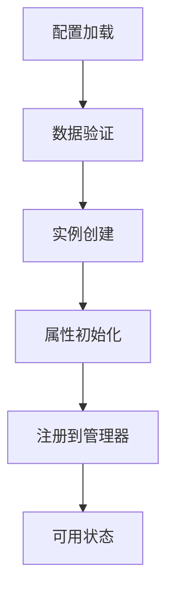
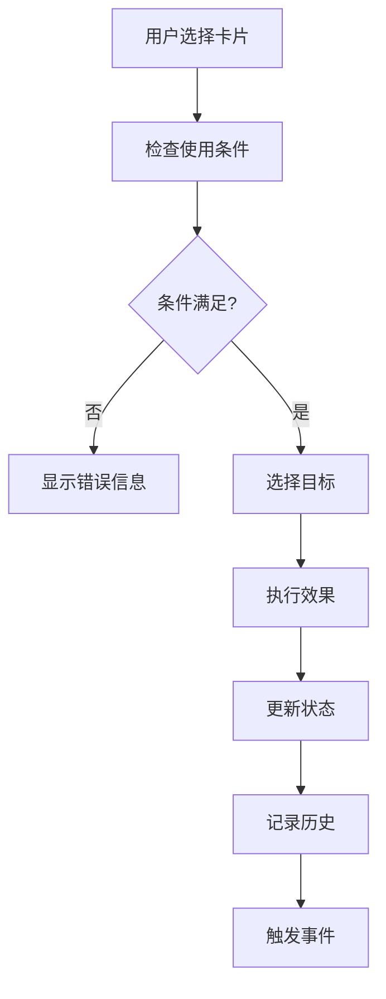
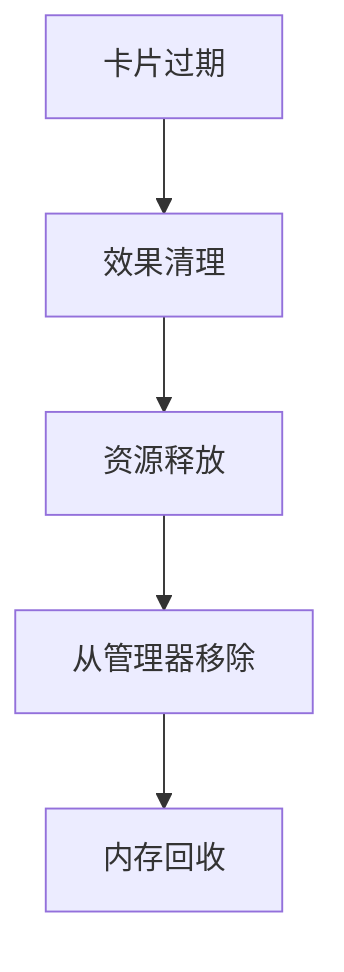

# Web3 Tycoon 卡片系统技术设计文档

## 概述

本文档详细介绍了Web3 Tycoon游戏卡片系统的技术实现，包括架构设计、数据结构、核心算法以及扩展机制。本文档面向技术人员，提供系统实现的技术细节。

## 目录

1. [系统架构](#系统架构)
2. [核心数据结构](#核心数据结构)
3. [卡片生命周期](#卡片生命周期)
4. [效果系统](#效果系统)
5. [UI交互系统](#ui交互系统)
6. [性能优化](#性能优化)
7. [扩展机制](#扩展机制)

---

## 系统架构

### 1. 整体架构

```
┌─────────────────┐    ┌─────────────────┐    ┌─────────────────┐
│   CardManager   │    │ CardController  │    │   CardFactory   │
│   (管理器)      │◄──►│   (控制器)      │◄──►│   (工厂)        │
└─────────────────┘    └─────────────────┘    └─────────────────┘
         │                       │                       │
         ▼                       ▼                       ▼
┌─────────────────┐    ┌─────────────────┐    ┌─────────────────┐
│  CardInstance   │    │   CardEffect    │    │   CardUI        │
│   (实例)        │◄──►│   (效果)        │◄──►│   (界面)        │
└─────────────────┘    └─────────────────┘    └─────────────────┘
```

### 2. 核心组件

#### 2.1 CardManager (卡片管理器)
- **职责**：管理系统中所有卡片的生命周期
- **功能**：
  - 卡片实例的创建和销毁
  - 卡片数据的加载和管理
  - 卡片使用的权限检查
  - 卡片效果的执行和回滚

#### 2.2 CardController (卡片控制器)
- **职责**：处理卡片相关的业务逻辑
- **功能**：
  - 卡片使用流程控制
  - 目标选择逻辑
  - 效果计算和应用
  - 状态同步

#### 2.3 CardFactory (卡片工厂)
- **职责**：创建和管理卡片实例
- **功能**：
  - 根据配置创建卡片实例
  - 卡片数据的验证
  - 卡片属性的初始化

---

## 核心数据结构

### 1. 卡片基础数据结构

```typescript
interface CardData {
  // 基础标识
  id: string;
  type: CardType;
  name: string;
  description: string;
  detailDescription: string;

  // 游戏属性
  rarity: CardRarity;
  usageTiming: CardUsageTiming;
  targetType: CardTargetType;
  effects: CardEffectParams[];

  // 限制条件
  cost?: number;
  cooldown?: number;
  maxUses?: number;

  // 视觉配置
  visualConfig: CardVisualConfig;

  // 其他属性
  dropWeight: number;
  tags: string[];
}
```

### 2. 卡片实例数据结构

```typescript
interface CardInstance {
  // 实例标识
  instanceId: string;
  cardId: string;
  ownerId: string;

  // 运行时状态
  state: CardState;
  remainingUses?: number;
  remainingCooldown?: number;

  // 历史记录
  acquiredAt: number;
  lastUsedAt?: number;

  // 扩展属性
  enhancementLevel?: number;
  instanceData?: { [key: string]: any };
}
```

### 3. 效果参数数据结构

```typescript
interface CardEffectParams {
  type: CardEffectType;
  value?: number;
  duration?: number;
  range?: number;
  conditions?: { [key: string]: any };
  customParams?: { [key: string]: any };
}
```

### 4. 使用上下文数据结构

```typescript
interface CardUseContext {
  // 使用者信息
  player: PlayerData;
  playerId: string;

  // 使用条件
  currentTurn: number;
  gamePhase: GamePhase;

  // 目标信息
  target?: {
    playerId?: string;
    tileId?: number;
    position?: Vec3;
    customTarget?: any;
  };

  // 附加参数
  parameters?: { [key: string]: any };

  // 环境信息
  gameMap: GameMap;
  activeEffects: GameEffect[];
}
```

---

## 卡片生命周期

### 1. 创建阶段



### 2. 使用流程



### 3. 销毁阶段



---

## 效果系统

### 1. 效果类型体系

#### 1.1 基础效果类型

```typescript
enum CardEffectType {
  // 骰子控制
  CONTROL_DICE = 'control_dice',

  // 位置移动
  TELEPORT_MOVE = 'teleport_move',
  FORCE_MOVE = 'force_move',

  // 障碍物操作
  PLACE_BARRIER = 'place_barrier',
  REMOVE_BARRIER = 'remove_barrier',

  // 建筑操作
  BUILDING_OPERATION = 'building_operation',

  // 经济操作
  MONEY_OPERATION = 'money_operation',

  // 状态效果
  STATUS_EFFECT = 'status_effect',

  // 规则修改
  RULE_MODIFICATION = 'rule_modification'
}
```

#### 1.2 效果执行流程

```typescript
class EffectExecutor {
  async executeEffect(
    effect: CardEffectParams,
    context: CardUseContext
  ): Promise<EffectResult> {
    // 1. 预处理
    const preResult = await this.preProcess(effect, context);

    // 2. 条件检查
    if (!this.checkConditions(effect, context)) {
      return { success: false, reason: '条件不满足' };
    }

    // 3. 效果计算
    const calculatedEffect = this.calculateEffect(effect, context);

    // 4. 效果应用
    const applyResult = await this.applyEffect(calculatedEffect, context);

    // 5. 后处理
    await this.postProcess(effect, context, applyResult);

    return applyResult;
  }
}
```

### 2. 效果组合系统

#### 2.1 效果组合器

```typescript
class EffectCombiner {
  combineEffects(effects: CardEffectParams[]): CombinedEffect {
    const combined = {
      primaryEffects: [],
      modifierEffects: [],
      conditionalEffects: []
    };

    for (const effect of effects) {
      switch (this.getEffectCategory(effect)) {
        case 'primary':
          combined.primaryEffects.push(effect);
          break;
        case 'modifier':
          combined.modifierEffects.push(effect);
          break;
        case 'conditional':
          combined.conditionalEffects.push(effect);
          break;
      }
    }

    return combined;
  }
}
```

#### 2.2 效果冲突解决

```typescript
class EffectResolver {
  resolveConflicts(effects: CardEffectParams[]): ResolvedEffects {
    const resolved = [];
    const conflicts = this.detectConflicts(effects);

    for (const conflict of conflicts) {
      const winner = this.resolveConflict(conflict);
      resolved.push(winner);
    }

    return resolved;
  }
}
```

---

## UI交互系统

### 1. 卡片UI组件

#### 1.1 卡片显示组件

```typescript
class CardDisplay extends Component {
  @property(Sprite)
  cardIcon: Sprite;

  @property(Label)
  cardName: Label;

  @property(Label)
  cardDescription: Label;

  @property(Node)
  rarityGlow: Node;

  updateDisplay(cardData: CardData) {
    this.cardName.string = cardData.name;
    this.cardDescription.string = cardData.description;
    this.updateRarityDisplay(cardData.rarity);
    this.updateIcon(cardData.visualConfig.iconPath);
  }
}
```

#### 1.2 手牌管理组件

```typescript
class CardHand extends Component {
  @property(Prefab)
  cardPrefab: Prefab;

  @property(Node)
  cardContainer: Node;

  private _cards: CardInstance[] = [];

  addCard(card: CardInstance) {
    this._cards.push(card);
    this.createCardUI(card);
    this.updateLayout();
  }

  removeCard(cardId: string) {
    const index = this._cards.findIndex(c => c.instanceId === cardId);
    if (index !== -1) {
      this._cards.splice(index, 1);
      this.updateLayout();
    }
  }
}
```

### 2. 目标选择系统

#### 2.1 目标选择器

```typescript
class TargetSelector {
  async selectTarget(
    targetType: CardTargetType,
    context: CardUseContext
  ): Promise<TargetSelectionResult> {
    switch (targetType) {
      case CardTargetType.TILE:
        return await this.selectTileTarget(context);
      case CardTargetType.PLAYER:
        return await this.selectPlayerTarget(context);
      case CardTargetType.BUILDING:
        return await this.selectBuildingTarget(context);
      default:
        return { success: false, reason: '不支持的目标类型' };
    }
  }
}
```

#### 2.2 地图交互

```typescript
class MapInteractionHandler {
  private _selectedTiles: number[] = [];
  private _selectionMode: SelectionMode = SelectionMode.NONE;

  startTileSelection(maxCount: number = 1) {
    this._selectionMode = SelectionMode.TILE;
    this._selectedTiles = [];

    // 启用地图交互
    this.enableMapInteraction();

    // 显示选择提示
    this.showSelectionHint(maxCount);
  }

  onTileClicked(tileId: number) {
    if (this._selectionMode !== SelectionMode.TILE) return;

    if (this._selectedTiles.includes(tileId)) {
      // 取消选择
      this.deselectTile(tileId);
    } else {
      // 选择地块
      this.selectTile(tileId);
    }

    this.updateSelectionUI();
  }
}
```

---

## 性能优化

### 1. 卡片实例池

```typescript
class CardPool {
  private _pool: Map<string, CardInstance[]> = new Map();

  getCard(cardId: string): CardInstance | null {
    const cards = this._pool.get(cardId);
    if (cards && cards.length > 0) {
      return cards.pop()!;
    }
    return null;
  }

  returnCard(card: CardInstance) {
    const cards = this._pool.get(card.cardId) || [];
    cards.push(card);
    this._pool.set(card.cardId, cards);

    // 限制池大小
    if (cards.length > this.MAX_POOL_SIZE) {
      cards.shift();
    }
  }
}
```

### 2. 效果缓存系统

```typescript
class EffectCache {
  private _effectCache: Map<string, CachedEffect> = new Map();

  getCachedEffect(
    effectId: string,
    context: CardUseContext
  ): CardEffectParams | null {
    const key = this.generateCacheKey(effectId, context);
    const cached = this._effectCache.get(key);

    if (cached && this.isCacheValid(cached)) {
      return cached.effect;
    }

    return null;
  }

  cacheEffect(
    effectId: string,
    effect: CardEffectParams,
    context: CardUseContext
  ) {
    const key = this.generateCacheKey(effectId, context);
    this._effectCache.set(key, {
      effect: effect,
      context: context,
      timestamp: Date.now()
    });
  }
}
```

### 3. 批量处理优化

```typescript
class BatchProcessor {
  private _pendingEffects: CardEffectParams[] = [];
  private _processingBatch = false;

  async addToBatch(effect: CardEffectParams) {
    this._pendingEffects.push(effect);

    if (!this._processingBatch) {
      await this.processBatch();
    }
  }

  private async processBatch() {
    this._processingBatch = true;

    while (this._pendingEffects.length > 0) {
      const batch = this._pendingEffects.splice(0, this.BATCH_SIZE);

      // 批量处理效果
      await Promise.all(
        batch.map(effect => this.processEffect(effect))
      );
    }

    this._processingBatch = false;
  }
}
```

---

## 扩展机制

### 1. 自定义卡片扩展

```typescript
interface CustomCardExtension {
  // 扩展标识
  extensionId: string;
  name: string;
  version: string;

  // 自定义卡片类型
  customCardTypes: CustomCardType[];

  // 自定义效果类型
  customEffectTypes: CustomEffectType[];

  // 扩展方法
  initialize(): Promise<void>;
  cleanup(): Promise<void>;
}

// 使用示例
class MyCustomCardExtension implements CustomCardExtension {
  extensionId = 'my_custom_cards';
  name = '我的自定义卡片';
  version = '1.0.0';

  customCardTypes = [
    {
      typeId: 'super_teleport',
      name: '超级传送',
      baseType: CardType.TELEPORT,
      customProperties: {
        unlimitedRange: true,
        instantCooldown: true
      }
    }
  ];

  async initialize() {
    // 注册自定义卡片类型
    CardRegistry.registerCustomTypes(this.customCardTypes);

    // 注册自定义效果处理器
    EffectRegistry.registerCustomHandlers(this.customEffectTypes);
  }
}
```

### 2. 模组系统

```typescript
interface CardMod {
  modId: string;
  name: string;
  description: string;
  author: string;
  version: string;

  // 模组内容
  cards: CardData[];
  effects: CustomEffectType[];
  uiExtensions: UIExtension[];

  // 生命周期
  onLoad(): Promise<void>;
  onUnload(): Promise<void>;
  onUpdate(): Promise<void>;
}

// 模组加载器
class ModLoader {
  private _loadedMods: Map<string, CardMod> = new Map();

  async loadMod(modPath: string): Promise<boolean> {
    try {
      const mod = await this.loadModFromPath(modPath);

      // 验证模组
      if (!this.validateMod(mod)) {
        console.error(`模组验证失败: ${mod.modId}`);
        return false;
      }

      // 初始化模组
      await mod.onLoad();

      // 注册模组内容
      this.registerModContent(mod);

      this._loadedMods.set(mod.modId, mod);
      return true;

    } catch (error) {
      console.error(`加载模组失败: ${modPath}`, error);
      return false;
    }
  }
}
```

### 3. 事件系统扩展

```typescript
interface CardEventExtension {
  eventType: string;
  priority: number;

  // 事件处理器
  onCardCreated?(card: CardInstance): Promise<void>;
  onCardUsed?(context: CardUseContext): Promise<void>;
  onEffectApplied?(effect: CardEffectParams, result: EffectResult): Promise<void>;
  onCardDestroyed?(card: CardInstance): Promise<void>;
}

// 事件分发器
class CardEventDispatcher {
  private _listeners: Map<string, CardEventExtension[]> = new Map();

  registerListener(extension: CardEventExtension) {
    const listeners = this._listeners.get(extension.eventType) || [];
    listeners.push(extension);
    listeners.sort((a, b) => a.priority - b.priority);
    this._listeners.set(extension.eventType, listeners);
  }

  async dispatchEvent(eventType: string, ...args: any[]) {
    const listeners = this._listeners.get(eventType) || [];

    for (const listener of listeners) {
      try {
        const handler = listener[`on${eventType}`];
        if (handler) {
          await handler.apply(listener, args);
        }
      } catch (error) {
        console.error(`事件处理器执行失败: ${eventType}`, error);
      }
    }
  }
}
```

---

## 总结

卡片系统采用了模块化、事件驱动的架构设计，具有以下特点：

1. **高扩展性**：通过插件系统支持自定义卡片和效果
2. **高性能**：采用对象池、缓存等优化技术
3. **高可维护性**：清晰的分层架构和模块化设计
4. **高灵活性**：支持复杂的卡片组合和效果叠加

未来将继续完善系统性能和扩展能力，为玩家提供更丰富的游戏体验。
