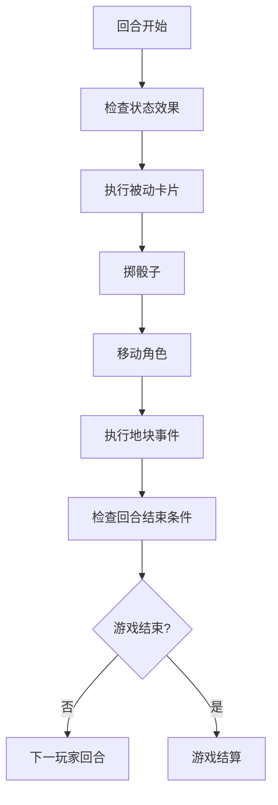

# Web3 Tycoon 游戏逻辑与规则设计文档

## 概述

本文档详细定义了Web3 Tycoon游戏的核心游戏逻辑、规则系统以及平衡机制。基于经典大富翁游戏规则，结合Web3元素和现代游戏设计理念，为玩家提供公平、平衡、有趣的游戏体验。

## 目录

1. [游戏流程](#游戏流程)
2. [地产系统规则](#地产系统规则)
3. [卡片系统规则](#卡片系统规则)
4. [玩家状态管理](#玩家状态管理)
5. [经济系统平衡](#经济系统平衡)
6. [获胜条件](#获胜条件)
7. [特殊规则](#特殊规则)

---

## 游戏流程

### 1. 游戏初始化

#### 1.1 玩家设置
```typescript
interface GameSetup {
  playerCount: number;        // 玩家数量 (2-8)
  startingMoney: number;      // 起始资金 (默认1500)
  gameMode: GameMode;         // 游戏模式 (经典/快速/自定义)
  mapConfig: MapConfig;       // 地图配置
  ruleSet: RuleSet;          // 规则集
}
```

#### 1.2 游戏状态初始化
- 所有玩家起始资金相同
- 所有玩家从起点开始
- 随机决定玩家顺序
- 初始化游戏轮数计数器

### 2. 回合流程

#### 2.1 标准回合流程


#### 2.2 特殊情况处理
- **双骰子奖励**：掷出双骰子获得额外回合
- **监狱状态**：跳过掷骰子，直接进入地块事件处理
- **卡片中断**：某些卡片可以中断正常流程

### 3. 游戏结束条件

#### 3.1 标准胜利条件
- 只有一个玩家保持活跃状态
- 达到预设的轮数上限
- 达到预设的财富目标

#### 3.2 破产判定
- 现金为负数且无抵押资产
- 连续3回合无法支付债务
- 主动宣布破产

---

## 地产系统规则

### 1. 地产购买规则

#### 1.1 购买条件
```typescript
interface PurchaseConditions {
  // 基本条件
  isUnowned: boolean;              // 地产无主
  hasEnoughMoney: boolean;         // 玩家有足够资金
  notInJail: boolean;              // 玩家不在监狱
  notMortgaged: boolean;           // 地产未被抵押

  // 特殊条件
  canOverrideAuction?: boolean;    // 是否可以跳过拍卖
  hasPriority?: boolean;           // 是否有优先购买权
}
```

#### 1.2 购买流程
1. **检查条件**：验证所有购买条件
2. **资金验证**：确认玩家有足够现金
3. **所有权转移**：更新地产拥有者
4. **资产更新**：更新玩家资产统计
5. **事件记录**：记录购买事件

#### 1.3 拍卖机制
```typescript
interface AuctionProcess {
  startingPrice: number;           // 起拍价 (地产价格的50%)
  bidIncrement: number;            // 最小加价 (10-100)
  maxRounds: number;              // 最大拍卖轮数
  autoBidEnabled: boolean;        // 是否启用自动出价

  // 拍卖结果
  winner?: string;                // 获胜者ID
  finalPrice: number;             // 成交价
  auctionDuration: number;        // 拍卖时长
}
```

### 2. 地产建设规则

#### 2.1 建设条件
```typescript
interface ConstructionConditions {
  // 所有权条件
  isOwner: boolean;               // 是地产拥有者
  notMortgaged: boolean;          // 未被抵押
  hasBuildingPermit: boolean;     // 有建筑许可

  // 资源条件
  hasEnoughMoney: boolean;        // 有足够建设资金
  hasRequiredMaterials: boolean;  // 有必需材料

  // 规则条件
  followsBuildingOrder: boolean;  // 遵循建设顺序
  withinBuildingLimits: boolean;  // 在建筑限制内
}
```

#### 2.2 建筑等级系统
```typescript
enum BuildingLevel {
  EMPTY = 0,        // 空地
  HOUSE_1 = 1,      // 1栋房屋
  HOUSE_2 = 2,      // 2栋房屋
  HOUSE_3 = 3,      // 3栋房屋
  HOUSE_4 = 4,      // 4栋房屋
  HOTEL = 5,        // 酒店
  LANDMARK = 6      // 地标建筑 (扩展)
}

interface BuildingCosts {
  [BuildingLevel.HOUSE_1]: number;
  [BuildingLevel.HOUSE_2]: number;
  [BuildingLevel.HOUSE_3]: number;
  [BuildingLevel.HOUSE_4]: number;
  [BuildingLevel.HOTEL]: number;
  [BuildingLevel.LANDMARK]: number;
}
```

#### 2.3 垄断规则
```typescript
interface MonopolyRules {
  // 垄断判定
  monopolyThreshold: number;       // 垄断所需地产比例 (100%)
  monopolyBonus: number;          // 垄断租金倍数 (2x)

  // 垄断效果
  rentMultiplier: number;         // 租金倍数
  buildAnywhere: boolean;         // 可在任何地产建设
  tradePriority: boolean;         // 交易优先权

  // 垄断保护
  monopolyProtection: boolean;    // 垄断保护机制
  antiMonopolyCards: boolean;     // 反垄断卡片
}
```

### 3. 租金收取规则

#### 3.1 租金计算
```typescript
class RentCalculator {
  calculateRent(property: PropertyData, visitor: PlayerData): number {
    let baseRent = property.rent[property.buildingLevel];

    // 垄断加成
    if (this.isMonopoly(property)) {
      baseRent *= this.monopolyRules.rentMultiplier;
    }

    // 季节影响
    baseRent *= this.getSeasonMultiplier();

    // 卡片效果
    baseRent *= this.getCardMultiplier(visitor);

    return Math.floor(baseRent);
  }
}
```

#### 3.2 特殊租金情况
- **免租状态**：使用免租卡片
- **租金减免**：特定事件或状态
- **租金加倍**：垄断或其他加成效果
- **分期支付**：大额租金可分期

---

## 卡片系统规则

### 1. 卡片获取规则

#### 1.1 随机获取
```typescript
interface RandomCardAcquisition {
  // 获取概率
  baseProbability: number;        // 基础概率
  rarityMultipliers: {           // 稀有度倍数
    common: number;
    rare: number;
    epic: number;
    legendary: number;
  };

  // 获取限制
  maxCardsPerTurn: number;        // 每回合最大获取数
  maxHandSize: number;           // 最大手牌数
  duplicatePrevention: boolean;   // 防止重复获取
}
```

#### 1.2 商店购买
```typescript
interface CardShop {
  // 商品配置
  availableCards: CardData[];     // 可购买卡片
  priceMultiplier: number;        // 价格倍数
  stockLimits: Map<string, number>; // 库存限制

  // 购买规则
  bulkDiscount: boolean;          // 批量折扣
  memberDiscount: boolean;        // 会员折扣
  dailySpecials: boolean;         // 每日特惠
}
```

### 2. 卡片使用规则

#### 2.1 使用限制
```typescript
interface CardUsageLimits {
  // 基本限制
  maxCardsPerTurn: number;        // 每回合最大使用数
  maxCardsPerType: number;        // 每类型最大使用数

  // 冷却限制
  globalCooldown: number;         // 全局冷却时间
  typeCooldowns: Map<CardType, number>; // 类型冷却时间

  // 条件限制
  usageConditions: CardCondition[]; // 使用条件
  targetRestrictions: TargetRestriction[]; // 目标限制
}
```

#### 2.2 卡片组合规则
```typescript
interface CardCombination {
  // 组合条件
  requiredCards: string[];        // 所需卡片
  combinationBonus: number;       // 组合加成

  // 组合效果
  combinedEffect: CardEffectParams; // 组合效果
  combinationCost: number;        // 组合消耗

  // 限制条件
  maxCombinations: number;        // 最大组合次数
  combinationCooldown: number;    // 组合冷却时间
}
```

### 3. 卡片效果规则

#### 3.1 效果优先级
```typescript
enum EffectPriority {
  IMMEDIATE = 0,     // 立即生效
  HIGH = 1,         // 高优先级
  NORMAL = 2,       // 普通优先级
  LOW = 3,          // 低优先级
  PASSIVE = 4       // 被动效果
}
```

#### 3.2 效果冲突解决
```typescript
interface EffectConflict {
  // 冲突检测
  detectConflict(effects: CardEffectParams[]): ConflictInfo[];

  // 冲突解决
  resolveConflict(conflict: ConflictInfo): CardEffectParams;

  // 解决策略
  strategies: {
    override: boolean;      // 覆盖策略
    combine: boolean;       // 组合策略
    cancel: boolean;        // 取消策略
    delay: boolean;         // 延迟策略
  };
}
```

---

## 玩家状态管理

### 1. 玩家状态类型

#### 1.1 基本状态
```typescript
enum PlayerStatus {
  ACTIVE = 'active',           // 活跃状态
  INACTIVE = 'inactive',       // 非活跃状态
  BANKRUPT = 'bankrupt',       // 破产状态
  DISCONNECTED = 'disconnected' // 断开连接
}
```

#### 1.2 特殊状态
```typescript
interface SpecialStatus {
  // 监狱状态
  inJail: boolean;
  jailTurns: number;
  jailReason: string;

  // 保护状态
  protected: boolean;
  protectionTurns: number;
  protectionSource: string;

  // 增益状态
  buffs: StatusEffect[];
  debuffs: StatusEffect[];

  // 经济状态
  taxExemption: boolean;
  rentImmunity: boolean;
}
```

### 2. 玩家资产管理

#### 2.1 资产分类
```typescript
interface PlayerAssets {
  // 现金资产
  cash: number;
  bankDeposits: number;

  // 实物资产
  properties: PropertyData[];
  buildings: BuildingData[];

  // 虚拟资产
  cards: CardInstance[];
  stocks: StockHolding[];

  // 负债
  debts: DebtRecord[];
  mortgages: MortgageRecord[];
}
```

#### 2.2 资产评估
```typescript
class AssetEvaluator {
  evaluateTotalAssets(player: PlayerData): AssetEvaluation {
    const propertyValue = this.evaluateProperties(player.properties);
    const buildingValue = this.evaluateBuildings(player.buildings);
    const cardValue = this.evaluateCards(player.cards);
    const stockValue = this.evaluateStocks(player.stocks);

    const totalAssets = propertyValue + buildingValue + cardValue + stockValue;
    const totalLiabilities = this.evaluateLiabilities(player.debts, player.mortgages);

    const netWorth = totalAssets - totalLiabilities;

    return {
      totalAssets,
      totalLiabilities,
      netWorth,
      liquidityRatio: this.calculateLiquidityRatio(player),
      debtRatio: this.calculateDebtRatio(totalLiabilities, totalAssets)
    };
  }
}
```

### 3. 玩家行动管理

#### 3.1 行动类型
```typescript
enum PlayerAction {
  // 移动行动
  ROLL_DICE = 'roll_dice',
  MOVE = 'move',
  TELEPORT = 'teleport',

  // 地产行动
  BUY_PROPERTY = 'buy_property',
  BUILD_HOUSE = 'build_house',
  SELL_PROPERTY = 'sell_property',

  // 卡片行动
  USE_CARD = 'use_card',
  BUY_CARD = 'buy_card',
  TRADE_CARD = 'trade_card',

  // 经济行动
  PAY_RENT = 'pay_rent',
  COLLECT_RENT = 'collect_rent',
  MORTGAGE = 'mortgage',

  // 特殊行动
  GO_TO_JAIL = 'go_to_jail',
  GET_OUT_OF_JAIL = 'get_out_of_jail',
  DECLARE_BANKRUPTCY = 'declare_bankruptcy'
}
```

#### 3.2 行动验证
```typescript
interface ActionValidation {
  // 基本验证
  hasPermission: boolean;        // 有权限执行
  hasResources: boolean;         // 有足够资源
  isValidTiming: boolean;        // 时机正确

  // 状态验证
  playerStatusValid: boolean;    // 玩家状态有效
  gamePhaseValid: boolean;       // 游戏阶段有效

  // 规则验证
  followsRules: boolean;         // 遵守规则
  noConflicts: boolean;          // 无冲突

  // 错误信息
  errorMessages: string[];
}
```

---

## 经济系统平衡

### 1. 通货膨胀控制

#### 1.1 动态价格调整
```typescript
class DynamicPricing {
  // 价格调整因子
  inflationRate: number;         // 通货膨胀率
  scarcityMultiplier: number;    // 稀缺性倍数
  demandMultiplier: number;      // 需求倍数

  adjustPropertyPrice(property: PropertyData): number {
    let adjustedPrice = property.price;

    // 通货膨胀调整
    adjustedPrice *= (1 + this.inflationRate);

    // 稀缺性调整
    adjustedPrice *= this.calculateScarcityMultiplier(property);

    // 需求调整
    adjustedPrice *= this.calculateDemandMultiplier(property);

    return Math.floor(adjustedPrice);
  }
}
```

#### 1.2 经济周期管理
```typescript
interface EconomicCycle {
  // 周期阶段
  phase: EconomicPhase;          // 繁荣/衰退/萧条/复苏

  // 影响因子
  propertyPrices: number;        // 地产价格影响
  rentMultiplier: number;        // 租金倍数影响
  cardPrices: number;           // 卡片价格影响

  // 持续时间
  duration: number;             // 周期持续回合数
  transitionRules: TransitionRule[]; // 转换规则
}
```

### 2. 平衡机制

#### 2.1 贫富差距控制
```typescript
class WealthBalancer {
  // 平衡阈值
  wealthGapThreshold: number;    // 财富差距阈值
  autoBalanceEnabled: boolean;   // 自动平衡启用

  // 平衡机制
  progressiveTax: boolean;       // 累进税
  wealthRedistribution: boolean; // 财富再分配
  opportunityCards: boolean;     // 机会卡片

  checkWealthGap(players: PlayerData[]): BalanceAction[] {
    const sortedPlayers = players.sort((a, b) => b.netWorth - a.netWorth);
    const wealthGap = sortedPlayers[0].netWorth / sortedPlayers[sortedPlayers.length - 1].netWorth;

    if (wealthGap > this.wealthGapThreshold) {
      return this.generateBalanceActions(sortedPlayers);
    }

    return [];
  }
}
```

#### 2.2 游戏节奏控制
```typescript
interface GamePacing {
  // 回合时间限制
  turnTimeLimit: number;         // 回合时间限制
  totalGameTime: number;         // 总游戏时间

  // 事件频率
  eventFrequency: number;        // 事件发生频率
  cardDropRate: number;          // 卡片掉落率

  // 进度控制
  roundLimit: number;           // 回合数限制
  wealthGoal: number;           // 财富目标

  // 难度调整
  difficultyScaling: boolean;   // 难度递增
  adaptiveDifficulty: boolean;  // 自适应难度
}
```

---

## 获胜条件

### 1. 标准获胜条件

#### 1.1 单一 survivor
- 所有其他玩家破产
- 最后一个保持活跃状态的玩家获胜

#### 1.2 财富目标
- 达到预设的财富目标
- 财富计算包括现金、资产和负债

#### 1.3 时间限制
- 在规定回合数内达到目标
- 或在规定时间内积累最多财富

### 2. 扩展获胜条件

#### 2.1 成就系统
```typescript
interface AchievementCondition {
  // 成就类型
  type: AchievementType;

  // 达成条件
  conditions: AchievementRequirement[];

  // 奖励
  rewards: AchievementReward[];

  // 进度跟踪
  progress: AchievementProgress;
}
```

#### 2.2 多目标胜利
- **地产帝国**：拥有最多地产
- **建筑大亨**：建设最多建筑
- **卡片大师**：收集最多稀有卡片
- **投资专家**：获得最高投资回报

---

## 特殊规则

### 1. Web3特色规则

#### 1.1 NFT资产规则
```typescript
interface NFTRules {
  // NFT地产
  nftProperties: boolean;        // NFT地产启用
  transferability: boolean;      // 可转让性
  inheritance: boolean;          // 可继承

  // NFT卡片
  nftCards: boolean;            // NFT卡片启用
  cardEvolution: boolean;        // 卡片进化
  crossGameUsage: boolean;       // 跨游戏使用
}
```

#### 1.2 DeFi集成规则
```typescript
interface DeFiRules {
  // 借贷规则
  propertyMortgage: boolean;     // 地产抵押
  interestRates: number;         // 利率设置

  // 流动性挖矿
  liquidityMining: boolean;      // 流动性挖矿
  rewardDistribution: boolean;   // 奖励分配

  // 代币经济
  tokenEconomy: boolean;         // 代币经济
  tokenRewards: boolean;         // 代币奖励
}
```

### 2. 自定义规则系统

#### 2.1 规则模板
```typescript
interface RuleTemplate {
  templateId: string;
  name: string;
  description: string;

  // 规则配置
  propertyRules: PropertyRules;
  cardRules: CardRules;
  economicRules: EconomicRules;

  // 验证规则
  validationRules: ValidationRule[];
}
```

#### 2.2 规则验证
```typescript
class RuleValidator {
  validateGameRules(rules: GameRules): ValidationResult {
    const errors: string[] = [];
    const warnings: string[] = [];

    // 平衡性检查
    if (!this.checkBalance(rules)) {
      errors.push('规则平衡性不足');
    }

    // 可玩性检查
    if (!this.checkPlayability(rules)) {
      errors.push('规则可玩性不足');
    }

    // 一致性检查
    if (!this.checkConsistency(rules)) {
      warnings.push('规则存在不一致性');
    }

    return {
      isValid: errors.length === 0,
      errors,
      warnings
    };
  }
}
```

---

这个游戏逻辑和规则系统设计确保了游戏的公平性、平衡性和趣味性。通过精细的规则设计和平衡机制，为玩家提供优质的游戏体验。
