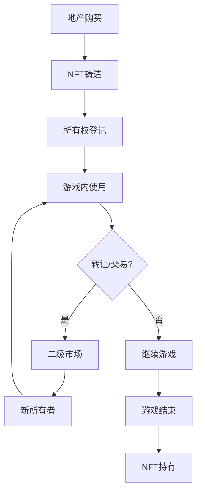
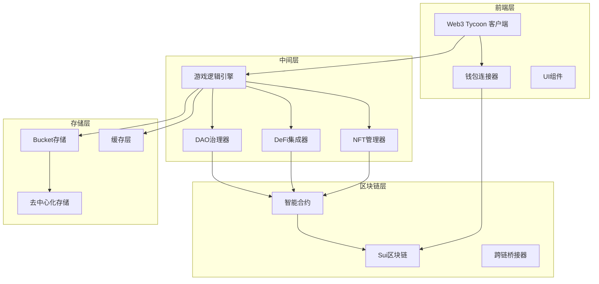

# Web3 Tycoon Web3集成设计文档

## 概述

本文档详细介绍了Web3 Tycoon游戏与区块链技术的深度集成方案，包括NFT资产系统、DeFi协议集成、DAO治理机制以及跨链互操作性。通过区块链技术，为游戏提供真正的数字所有权、去中心化经济系统和社区治理能力。

## 目录

1. [NFT资产系统](#nft资产系统)
2. [DeFi协议集成](#defi协议集成)
3. [DAO治理机制](#dao治理机制)
4. [代币经济系统](#代币经济系统)
5. [跨链互操作](#跨链互操作)
6. [安全与隐私](#安全与隐私)
7. [技术实现架构](#技术实现架构)

---

## NFT资产系统

### 1. NFT地产系统

#### 1.1 地产NFT架构
```typescript
interface PropertyNFT {
  // NFT基本信息
  tokenId: string;
  contractAddress: string;
  blockchain: string;

  // 游戏内属性
  propertyData: PropertyData;
  gameMapId: string;
  coordinates: { x: number; y: number };

  // 所有权信息
  owner: string;
  creator: string;
  createdAt: number;

  // 扩展属性
  rarity: PropertyRarity;
  attributes: PropertyAttribute[];
  level: number;
}
```

#### 1.2 地产NFT生命周期


#### 1.3 地产NFT属性系统
```typescript
interface PropertyAttribute {
  traitType: string;
  value: string | number;
  rarity: number;          // 稀有度 0-1
  gameImpact: number;      // 对游戏的影响程度

  // 视觉属性
  visualEffects?: VisualEffect[];

  // 功能属性
  bonuses?: PropertyBonus[];
}

interface PropertyBonus {
  type: BonusType;
  value: number;
  condition?: string;      // 生效条件
  duration?: number;       // 持续时间
}
```

### 2. NFT卡片系统

#### 2.1 卡片NFT架构
```typescript
interface CardNFT {
  // NFT标识
  tokenId: string;
  contractAddress: string;

  // 卡片数据
  cardData: CardData;
  instanceData: CardInstance;

  // 进化系统
  evolutionLevel: number;
  experience: number;
  evolutionRequirements: EvolutionRequirement[];

  // 合成属性
  synthesisCount: number;
  lastSynthesized: number;

  // 租赁属性
  isRentable: boolean;
  rentalPrice?: number;
  rentalDuration?: number;
}
```

#### 2.2 卡片NFT进化系统
```typescript
interface CardEvolution {
  // 进化阶段
  stages: EvolutionStage[];

  // 进化条件
  requirements: {
    experience: number;
    synthesisMaterials: CardNFT[];
    gameAchievements: string[];
    specialEvents: string[];
  };

  // 进化效果
  bonuses: {
    powerIncrease: number;
    cooldownReduction: number;
    newAbilities: CardAbility[];
  };
}
```

#### 2.3 卡片NFT租赁系统
```typescript
interface CardRental {
  // 租赁信息
  rentalId: string;
  nftTokenId: string;
  owner: string;
  renter: string;

  // 租赁条款
  rentalPrice: number;
  rentalDuration: number;    // 租赁时长(回合)
  usageLimit: number;        // 使用次数限制

  // 租赁状态
  status: RentalStatus;
  startTime: number;
  endTime: number;

  // 收益分配
  ownerShare: number;        // 所有者分成比例
  platformFee: number;       // 平台手续费
}
```

---

## DeFi协议集成

### 1. Scallop借贷协议集成

#### 1.1 地产抵押借贷
```typescript
interface PropertyMortgage {
  // 抵押信息
  mortgageId: string;
  propertyNFT: PropertyNFT;
  borrower: string;

  // 借贷参数
  loanAmount: number;
  interestRate: number;
  loanDuration: number;

  // 抵押品信息
  collateralValue: number;
  liquidationPrice: number;
  liquidationRatio: number;

  // 状态管理
  status: MortgageStatus;
  repaymentSchedule: RepaymentRecord[];
}
```

#### 1.2 动态利率系统
```typescript
class DynamicInterestRate {
  calculateInterestRate(
    propertyValue: number,
    borrowerCredit: number,
    marketConditions: MarketData
  ): number {
    let baseRate = this.getBaseRate();

    // 信用评分调整
    baseRate += this.adjustForCreditScore(borrowerCredit);

    // 抵押品价值调整
    baseRate += this.adjustForCollateralValue(propertyValue);

    // 市场条件调整
    baseRate += this.adjustForMarketConditions(marketConditions);

    return Math.max(this.minRate, Math.min(this.maxRate, baseRate));
  }
}
```

### 2. Navi流动性挖矿集成

#### 2.1 流动性池配置
```typescript
interface LiquidityPool {
  // 池子信息
  poolId: string;
  tokenA: string;
  tokenB: string;

  // 游戏资产
  gameAssets: GameAsset[];
  rewardTokens: RewardToken[];

  // 挖矿参数
  totalLiquidity: number;
  userLiquidity: Map<string, number>;
  rewardRate: number;

  // 风险参数
  impermanentLoss: number;
  poolFee: number;
}
```

#### 2.2 挖矿奖励系统
```typescript
interface MiningReward {
  // 奖励计算
  baseReward: number;
  bonusMultiplier: number;
  timeMultiplier: number;

  // 奖励类型
  tokenRewards: TokenReward[];
  nftRewards: NFTReward[];

  // 分配机制
  distributionMethod: DistributionMethod;
  vestingSchedule?: VestingSchedule;
}
```

### 3. Bucket数据存储集成

#### 3.1 游戏数据存储
```typescript
interface GameDataStorage {
  // 存储对象
  objectId: string;
  dataType: DataType;

  // 数据内容
  gameState: GameState;
  playerData: PlayerData;
  transactionHistory: TransactionRecord[];

  // 访问控制
  owner: string;
  accessList: AccessPermission[];
  encryptionKey?: string;

  // 元数据
  createdAt: number;
  lastModified: number;
  version: number;
}
```

#### 3.2 数据同步机制
```typescript
class DataSynchronizer {
  async syncGameData(
    localData: GameData,
    remoteData: GameDataStorage
  ): Promise<SyncResult> {
    // 版本检查
    const versionDiff = this.compareVersions(localData, remoteData);

    if (versionDiff.isConflict) {
      // 解决冲突
      const resolvedData = await this.resolveConflict(localData, remoteData);
      return await this.uploadData(resolvedData);
    }

    // 正常同步
    return await this.uploadData(localData);
  }
}
```

---

## DAO治理机制

### 1. 游戏规则治理

#### 1.1 提案系统
```typescript
interface GovernanceProposal {
  // 提案基本信息
  proposalId: string;
  proposer: string;
  title: string;
  description: string;

  // 提案内容
  proposalType: ProposalType;
  changes: GameRuleChange[];

  // 投票参数
  votingPeriod: number;
  quorumRequired: number;
  approvalThreshold: number;

  // 投票结果
  votes: VoteRecord[];
  status: ProposalStatus;
}
```

#### 1.2 投票机制
```typescript
interface VotingSystem {
  // 投票权重计算
  calculateVotingPower(
    voter: string,
    proposal: GovernanceProposal
  ): number {
    let power = 0;

    // 代币持有量
    power += this.getTokenBalance(voter) * this.tokenWeight;

    // NFT持有量
    power += this.getNFTHolding(voter) * this.nftWeight;

    // 游戏活跃度
    power += this.getActivityScore(voter) * this.activityWeight;

    return power;
  }

  // 投票执行
  async executeProposal(proposal: GovernanceProposal): Promise<boolean> {
    if (this.isApproved(proposal)) {
      return await this.implementChanges(proposal.changes);
    }
    return false;
  }
}
```

### 2. 经济参数治理

#### 2.1 动态经济调整
```typescript
interface EconomicParameter {
  parameterId: string;
  name: string;
  currentValue: number;
  minValue: number;
  maxValue: number;

  // 调整规则
  adjustmentRules: AdjustmentRule[];

  // 治理历史
  adjustmentHistory: ParameterAdjustment[];
}
```

#### 2.2 社区基金管理
```typescript
interface CommunityFund {
  // 基金信息
  fundId: string;
  totalBalance: number;
  availableBalance: number;

  // 资金来源
  sources: FundSource[];

  // 分配规则
  allocationRules: AllocationRule[];

  // 使用历史
  expenditures: FundExpenditure[];
}
```

---

## 代币经济系统

### 1. 游戏代币设计

#### 1.1 代币类型
```typescript
enum TokenType {
  UTILITY_TOKEN = 'utility',      // 实用代币 (游戏内消费)
  GOVERNANCE_TOKEN = 'governance', // 治理代币 (投票权)
  REWARD_TOKEN = 'reward',        // 奖励代币 (激励机制)
  NFT_TOKEN = 'nft'              // NFT代币 (资产代币化)
}
```

#### 1.2 代币分配机制
```typescript
interface TokenDistribution {
  // 初始分配
  initialSupply: number;
  teamAllocation: number;         // 团队分配比例
  communityAllocation: number;    // 社区分配比例
  treasuryAllocation: number;     // 金库分配比例

  // 持续分配
  miningRewards: number;          // 挖矿奖励
  stakingRewards: number;         // 质押奖励
  gameRewards: number;           // 游戏奖励

  // 销毁机制
  burnMechanism: BurnMechanism;
  deflationRate: number;
}
```

### 2. 代币激励机制

#### 2.1 游戏内激励
```typescript
interface GameIncentive {
  // 成就奖励
  achievementRewards: {
    achievementId: string;
    tokenReward: number;
    nftReward?: string;
  }[];

  // 排名奖励
  leaderboardRewards: {
    rank: number;
    tokenReward: number;
    bonusMultiplier: number;
  }[];

  // 活动奖励
  eventRewards: {
    eventId: string;
    participationReward: number;
    completionReward: number;
  }[];
}
```

#### 2.2 社区激励
```typescript
interface CommunityIncentive {
  // 贡献奖励
  contributionRewards: {
    contributionType: string;
    baseReward: number;
    qualityMultiplier: number;
  }[];

  // 治理参与奖励
  governanceRewards: {
    participationReward: number;
    proposalReward: number;
    votingReward: number;
  };

  // 流动性提供奖励
  liquidityRewards: {
    poolId: string;
    rewardRate: number;
    bonusPeriod: number;
  };
}
```

---

## 跨链互操作

### 1. 跨链资产转移

#### 1.1 资产桥接
```typescript
interface AssetBridge {
  // 桥接配置
  sourceChain: string;
  targetChain: string;
  supportedAssets: string[];

  // 转移流程
  bridgeAsset(
    assetId: string,
    fromChain: string,
    toChain: string,
    amount: number,
    recipient: string
  ): Promise<BridgeTransaction>;

  // 状态查询
  getBridgeStatus(transactionId: string): BridgeStatus;

  // 费用计算
  calculateBridgeFee(
    assetId: string,
    fromChain: string,
    toChain: string,
    amount: number
  ): BridgeFee;
}
```

#### 1.2 跨链NFT转移
```typescript
interface CrossChainNFT {
  // NFT跨链信息
  originalChain: string;
  currentChain: string;
  canonicalId: string;

  // 转移记录
  transferHistory: ChainTransfer[];

  // 状态同步
  syncStatus: SyncStatus;
  lastSyncTime: number;
}
```

### 2. 多链游戏状态同步

#### 2.1 状态同步协议
```typescript
interface StateSyncProtocol {
  // 同步配置
  syncInterval: number;
  maxLatency: number;
  retryAttempts: number;

  // 同步数据
  syncGameState(
    gameId: string,
    fromChain: string,
    toChain: string
  ): Promise<SyncResult>;

  // 冲突解决
  resolveStateConflict(
    localState: GameState,
    remoteState: GameState
  ): GameState;

  // 验证同步
  validateSync(
    originalState: GameState,
    syncedState: GameState
  ): ValidationResult;
}
```

---

## 安全与隐私

### 1. 智能合约安全

#### 1.1 安全审计
```typescript
interface SecurityAudit {
  // 审计信息
  auditId: string;
  auditor: string;
  auditDate: number;

  // 审计范围
  contracts: string[];
  functions: string[];

  // 审计结果
  vulnerabilities: Vulnerability[];
  recommendations: Recommendation[];

  // 审计状态
  status: AuditStatus;
  remediationStatus: RemediationStatus;
}
```

#### 1.2 访问控制
```typescript
interface AccessControl {
  // 权限角色
  roles: {
    admin: string[];
    moderator: string[];
    player: string[];
    guest: string[];
  };

  // 功能权限
  permissions: {
    mintNFT: string[];
    transferAsset: string[];
    createProposal: string[];
    vote: string[];
  };

  // 权限检查
  hasPermission(
    user: string,
    action: string,
    resource?: string
  ): boolean;
}
```

### 2. 隐私保护

#### 2.1 数据隐私
```typescript
interface PrivacyProtection {
  // 数据分类
  publicData: string[];       // 公开数据
  privateData: string[];      // 私有数据
  sensitiveData: string[];    // 敏感数据

  // 隐私设置
  userPrivacySettings: {
    profileVisibility: VisibilityLevel;
    gameHistoryVisibility: VisibilityLevel;
    assetVisibility: VisibilityLevel;
  };

  // 数据加密
  encryptData(data: any, userId: string): Promise<string>;
  decryptData(encryptedData: string, userId: string): Promise<any>;
}
```

---

## 技术实现架构

### 1. 系统架构图



### 2. 核心模块设计

#### 2.1 Web3连接器
```typescript
class Web3Connector {
  // 钱包连接
  async connectWallet(walletType: WalletType): Promise<WalletConnection>;

  // 网络切换
  async switchNetwork(chainId: number): Promise<boolean>;

  // 交易签名
  async signTransaction(tx: Transaction): Promise<SignedTransaction>;

  // 事件监听
  onWalletEvent(event: WalletEvent, callback: Function): void;
}
```

#### 2.2 区块链交互器
```typescript
class BlockchainInteractor {
  // 合约调用
  async callContract(
    contractAddress: string,
    method: string,
    params: any[]
  ): Promise<any>;

  // 交易发送
  async sendTransaction(
    contractAddress: string,
    method: string,
    params: any[],
    value?: string
  ): Promise<TransactionResult>;

  // 事件监听
  listenToEvents(
    contractAddress: string,
    eventName: string,
    callback: Function
  ): EventSubscription;
}
```

#### 2.3 NFT管理器
```typescript
class NFTManager {
  // NFT铸造
  async mintNFT(
    type: NFTType,
    metadata: NFTMetadata,
    recipient: string
  ): Promise<MintResult>;

  // NFT转移
  async transferNFT(
    tokenId: string,
    from: string,
    to: string
  ): Promise<TransferResult>;

  // NFT查询
  async getNFTMetadata(tokenId: string): Promise<NFTMetadata>;

  // NFT持有查询
  async getUserNFTs(userAddress: string): Promise<NFTData[]>;
}
```

---

这个Web3集成设计为游戏提供了完整的区块链功能支持，包括NFT资产、DeFi协议、DAO治理等。通过精心设计的架构，确保了系统的安全性、可扩展性和用户体验。
