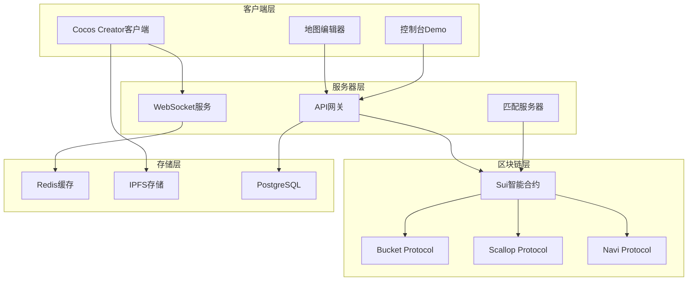

# Web3 Tycoon 技术架构设计

## 总体架构概览



## 1. 区块链层设计

### 1.1 Sui智能合约架构

**核心合约模块：**
```move
// 主游戏合约
module tycoon::game {
    use sui::object::{Self, UID};
    use sui::transfer;
    use sui::tx_context::{Self, TxContext};
    
    // 游戏状态结构
    struct Game has key, store {
        id: UID,
        players: vector<address>,
        current_player: u8,
        turn_count: u64,
        board: Board,
        status: u8, // 0: waiting, 1: playing, 2: ended
        winner: Option<address>
    }
    
    // 玩家状态
    struct Player has key, store {
        id: UID,
        address: address,
        balance: u64,
        position: u8,
        properties: vector<u32>,
        in_hospital: bool,
        hospital_turns: u8
    }
}
```

**地产管理合约：**
```move
module tycoon::property {
    struct Property has key, store {
        id: UID,
        tile_id: u32,
        name: String,
        price: u64,
        rent: u64,
        owner: Option<address>,
        houses: u8,
        hotels: u8,
        is_mortgaged: bool
    }
    
    // 地产NFT
    struct PropertyNFT has key, store {
        id: UID,
        property_id: u32,
        metadata_url: String,
        level: u8,
        special_attributes: vector<String>
    }
}
```

### 1.2 DeFi协议集成

**Bucket Protocol集成：**
```move
module tycoon::bucket_integration {
    use bucket::data_bucket::{Self, DataBucket};
    
    // 游戏数据存储桶
    struct GameDataBucket has key {
        id: UID,
        bucket: DataBucket<GameState>,
        access_control: vector<address>
    }
    
    // 存储游戏状态到Bucket
    public fun store_game_state(
        bucket: &mut GameDataBucket,
        game: &Game,
        ctx: &mut TxContext
    ) {
        // 实现游戏状态序列化和存储
    }
}
```

**Scallop Protocol集成：**
```move
module tycoon::scallop_integration {
    use scallop::lending_pool::{Self, LendingPool};
    
    // 地产抵押贷款
    struct PropertyLoan has key {
        id: UID,
        borrower: address,
        collateral_property: u32,
        loan_amount: u64,
        interest_rate: u64,
        due_date: u64
    }
    
    // 抵押地产获得贷款
    public entry fun mortgage_property(
        property: &PropertyNFT,
        amount: u64,
        pool: &mut LendingPool,
        ctx: &mut TxContext
    ) {
        // 实现地产抵押逻辑
    }
}
```

**Navi Protocol集成：**
```move
module tycoon::navi_integration {
    use navi::liquidity_pool::{Self, Pool};
    
    // 流动性挖矿奖励
    struct LiquidityReward has key {
        id: UID,
        provider: address,
        staked_amount: u64,
        reward_rate: u64,
        last_claim: u64
    }
    
    // 质押代币挖矿
    public entry fun stake_for_mining(
        amount: u64,
        pool: &mut Pool,
        ctx: &mut TxContext
    ) {
        // 实现流动性挖矿逻辑
    }
}
```

### 1.3 Gas费优化策略

**批量操作设计：**
```move
// 批量处理多个玩家回合
public entry fun batch_process_turns(
    game: &mut Game,
    dice_results: vector<u8>,
    ctx: &mut TxContext
) {
    let i = 0;
    let len = vector::length(&dice_results);
    
    while (i < len) {
        let dice = *vector::borrow(&dice_results, i);
        process_single_turn(game, dice, ctx);
        i = i + 1;
    };
}

// 状态压缩存储
struct CompactGameState has store {
    // 使用位域压缩多个布尔值
    player_flags: u32, // 32个布尔状态
    positions: u32,    // 4个玩家位置（每个8位）
    balances: vector<u64> // 余额数组
}
```

## 2. 服务器层设计

### 2.1 匹配服务器架构

**Node.js + TypeScript实现：**
```typescript
// 房间管理器
class RoomManager {
    private rooms: Map<string, GameRoom> = new Map();
    private waitingPlayers: Player[] = [];
    
    // 玩家匹配逻辑
    async matchPlayers(): Promise<GameRoom | null> {
        if (this.waitingPlayers.length >= 4) {
            const players = this.waitingPlayers.splice(0, 4);
            const room = new GameRoom(players);
            this.rooms.set(room.id, room);
            return room;
        }
        return null;
    }
    
    // 处理玩家断线重连
    async handleReconnection(playerId: string, socketId: string) {
        // 重连逻辑实现
    }
}

// 游戏房间
class GameRoom {
    id: string;
    players: Player[];
    gameState: GameState;
    sockets: Map<string, WebSocket>;
    
    // 同步游戏状态到所有客户端
    broadcastGameState() {
        const stateUpdate = {
            type: 'GAME_STATE_UPDATE',
            data: this.gameState
        };
        
        this.sockets.forEach(socket => {
            socket.send(JSON.stringify(stateUpdate));
        });
    }
}
```

### 2.2 WebSocket通信协议

**消息类型定义：**
```typescript
// 消息基础结构
interface BaseMessage {
    type: string;
    timestamp: number;
    playerId: string;
}

// 游戏动作消息
interface GameActionMessage extends BaseMessage {
    type: 'GAME_ACTION';
    action: {
        type: 'ROLL_DICE' | 'BUY_PROPERTY' | 'UPGRADE_PROPERTY';
        data: any;
    };
}

// 状态同步消息
interface StateUpdateMessage extends BaseMessage {
    type: 'STATE_UPDATE';
    gameState: GameState;
}

// 错误消息
interface ErrorMessage extends BaseMessage {
    type: 'ERROR';
    error: {
        code: string;
        message: string;
    };
}
```

### 2.3 API设计

**RESTful API结构：**
```typescript
// 游戏API路由
app.post('/api/games', createGame);           // 创建游戏
app.get('/api/games/:id', getGame);           // 获取游戏状态
app.post('/api/games/:id/join', joinGame);    // 加入游戏
app.post('/api/games/:id/leave', leaveGame);  // 离开游戏

// 玩家API路由
app.get('/api/players/:id', getPlayer);       // 获取玩家信息
app.put('/api/players/:id', updatePlayer);    // 更新玩家信息

// NFT API路由
app.get('/api/nfts/:id', getNFT);            // 获取NFT信息
app.post('/api/nfts/mint', mintNFT);         // 铸造NFT

// DeFi API路由
app.post('/api/defi/stake', stakeTokens);     // 质押代币
app.post('/api/defi/lend', lendTokens);       // 借贷操作
```

## 3. 客户端层设计

### 3.1 Cocos Creator架构

**场景管理：**
```typescript
// 场景管理器
class SceneManager {
    private static instance: SceneManager;
    private currentScene: cc.Scene;
    
    static getInstance(): SceneManager {
        if (!SceneManager.instance) {
            SceneManager.instance = new SceneManager();
        }
        return SceneManager.instance;
    }
    
    // 切换场景
    switchScene(sceneName: string, transition?: cc.Transition) {
        cc.director.loadScene(sceneName, transition);
    }
}

// 游戏场景控制器
@ccclass
export class GameSceneController extends cc.Component {
    @property(cc.Node)
    gameBoard: cc.Node = null;
    
    @property(cc.Node)
    uiPanel: cc.Node = null;
    
    private gameManager: GameManager;
    private networkManager: NetworkManager;
    
    onLoad() {
        this.gameManager = new GameManager();
        this.networkManager = new NetworkManager();
        this.initGame();
    }
    
    private initGame() {
        // 初始化游戏逻辑
        this.gameManager.init();
        // 连接服务器
        this.networkManager.connect();
    }
}
```

**网络通信模块：**
```typescript
// 网络管理器
class NetworkManager {
    private socket: WebSocket;
    private messageHandlers: Map<string, Function> = new Map();
    
    connect() {
        this.socket = new WebSocket('ws://localhost:3000');
        
        this.socket.onmessage = (event) => {
            const message = JSON.parse(event.data);
            this.handleMessage(message);
        };
    }
    
    // 发送消息
    send(message: any) {
        if (this.socket.readyState === WebSocket.OPEN) {
            this.socket.send(JSON.stringify(message));
        }
    }
    
    // 注册消息处理器
    registerHandler(type: string, handler: Function) {
        this.messageHandlers.set(type, handler);
    }
    
    private handleMessage(message: any) {
        const handler = this.messageHandlers.get(message.type);
        if (handler) {
            handler(message);
        }
    }
}
```

### 3.2 控制台Demo设计

**TypeScript控制台客户端：**
```typescript
// 控制台游戏客户端
class ConsoleGameClient {
    private suiClient: SuiClient;
    private gameState: GameState;
    
    constructor() {
        this.suiClient = new SuiClient({
            url: 'https://fullnode.devnet.sui.io'
        });
    }
    
    // 启动游戏
    async startGame() {
        console.log('🎲 Web3 Tycoon Console Demo');
        console.log('============================');
        
        await this.initializeGame();
        await this.gameLoop();
    }
    
    // 显示游戏状态
    displayGameState() {
        console.clear();
        console.log('Current Game State:');
        console.log(`Turn: ${this.gameState.turnCount}`);
        console.log(`Current Player: ${this.gameState.currentPlayer}`);
        
        // 显示棋盘
        this.renderBoard();
        
        // 显示玩家信息
        this.renderPlayers();
    }
    
    // 渲染棋盘
    private renderBoard() {
        const board = this.gameState.board;
        // ASCII艺术显示棋盘
        console.log('Board:');
        for (let i = 0; i < board.tiles.length; i++) {
            const tile = board.tiles[i];
            const players = this.getPlayersOnTile(i);
            console.log(`[${i.toString().padStart(2)}] ${tile.name} ${players}`);
        }
    }
}
```

## 4. 数据存储设计

### 4.1 链上数据存储

**游戏状态存储：**
```move
// 链上存储的核心数据
struct OnChainGameData has key, store {
    id: UID,
    game_id: u64,
    players: vector<address>,
    property_owners: Table<u32, address>,
    final_scores: Table<address, u64>,
    winner: Option<address>,
    start_time: u64,
    end_time: Option<u64>
}
```

### 4.2 链下数据缓存

**Redis缓存策略：**
```typescript
// Redis数据结构
interface CacheStructure {
    // 游戏会话缓存（TTL: 2小时）
    'game:session:{gameId}': GameState;
    
    // 玩家在线状态（TTL: 30分钟）
    'player:online:{playerId}': {
        socketId: string;
        lastActivity: number;
    };
    
    // 匹配队列
    'matchmaking:queue': string[]; // 玩家ID数组
    
    // 临时操作锁（TTL: 30秒）
    'lock:game:{gameId}:turn': boolean;
}
```

### 4.3 IPFS资源存储

**资源分发策略：**
```typescript
// IPFS存储内容
interface IPFSContent {
    // 游戏资源
    gameAssets: {
        maps: string;      // 地图数据
        sprites: string;   // 精灵图
        audio: string;     // 音频文件
    };
    
    // NFT元数据
    nftMetadata: {
        properties: string; // 地产NFT元数据
        characters: string; // 角色NFT元数据
    };
    
    // 游戏记录
    gameHistory: {
        replays: string;   // 游戏回放数据
        statistics: string; // 统计数据
    };
}
```

## 5. 安全性设计

### 5.1 智能合约安全

**访问控制：**
```move
// 权限管理
struct AdminCap has key { id: UID }

// 只有管理员可以调用
public entry fun admin_function(
    _: &AdminCap,
    // 其他参数
) {
    // 管理员功能实现
}

// 时间锁机制
struct TimeLock has key {
    id: UID,
    unlock_time: u64,
    target_function: String
}
```

### 5.2 防作弊机制

**随机数生成：**
```move
// 使用Sui的随机数源
public fun generate_dice_roll(
    random: &Random,
    ctx: &mut TxContext
): u8 {
    let seed = tx_context::epoch(ctx);
    let random_bytes = random::generate_bytes(random, 1);
    (vector::pop_back(&mut random_bytes) % 6) + 1
}
```

**操作验证：**
```typescript
// 客户端操作验证
class ActionValidator {
    // 验证移动是否合法
    validateMove(currentPos: number, diceRoll: number): boolean {
        const expectedPos = (currentPos + diceRoll) % 40;
        return true; // 详细验证逻辑
    }
    
    // 验证购买操作
    validatePurchase(playerId: string, propertyId: number): boolean {
        // 检查玩家余额、属性所有权等
        return true;
    }
}
```

## 6. 性能优化

### 6.1 链上性能优化

**批量操作：**
```move
// 批量处理减少交易数量
public entry fun batch_operations(
    operations: vector<Operation>,
    ctx: &mut TxContext
) {
    let i = 0;
    let len = vector::length(&operations);
    
    while (i < len) {
        let op = vector::borrow(&operations, i);
        execute_operation(op, ctx);
        i = i + 1;
    }
}
```

### 6.2 客户端性能优化

**对象池管理：**
```typescript
// Cocos Creator对象池
class ObjectPool<T extends cc.Node> {
    private pool: T[] = [];
    private createFunc: () => T;
    
    constructor(createFunc: () => T, initialSize: number = 10) {
        this.createFunc = createFunc;
        
        // 预创建对象
        for (let i = 0; i < initialSize; i++) {
            const obj = this.createFunc();
            obj.active = false;
            this.pool.push(obj);
        }
    }
    
    get(): T {
        if (this.pool.length > 0) {
            const obj = this.pool.pop();
            obj.active = true;
            return obj;
        }
        return this.createFunc();
    }
    
    put(obj: T) {
        obj.active = false;
        this.pool.push(obj);
    }
}
```

这个技术架构设计为Web3 Tycoon项目提供了完整的技术蓝图，涵盖了从区块链层到客户端的所有关键组件，确保项目能够在2个月内顺利完成开发。
