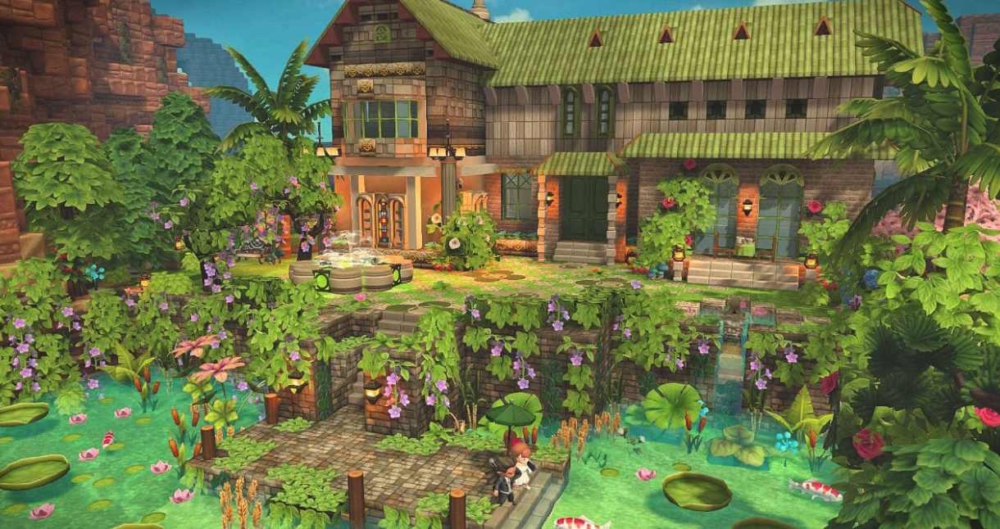
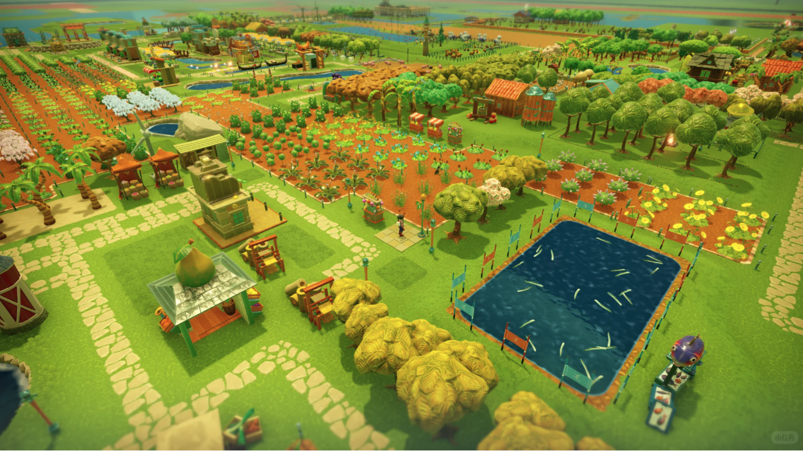
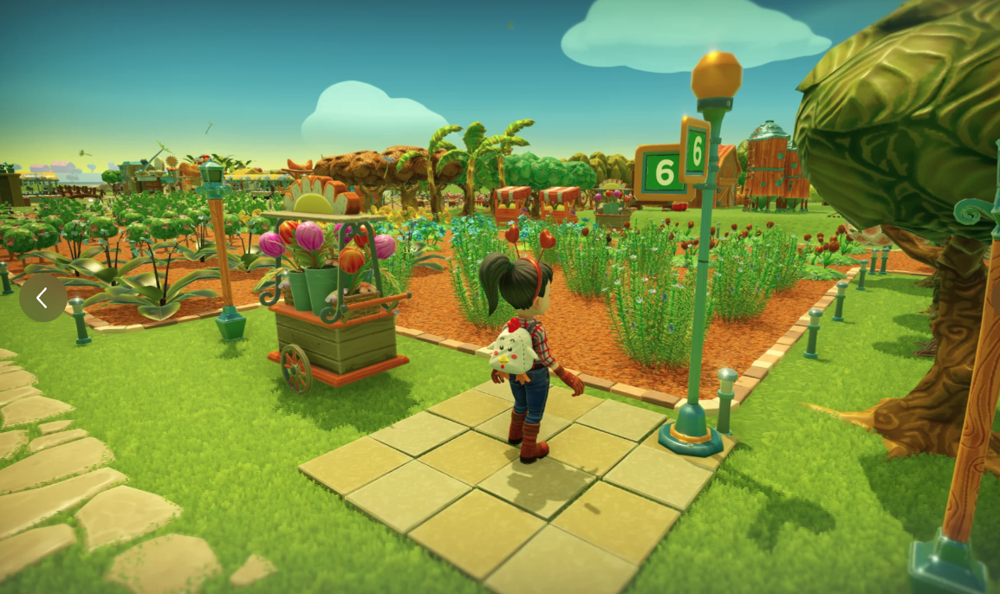
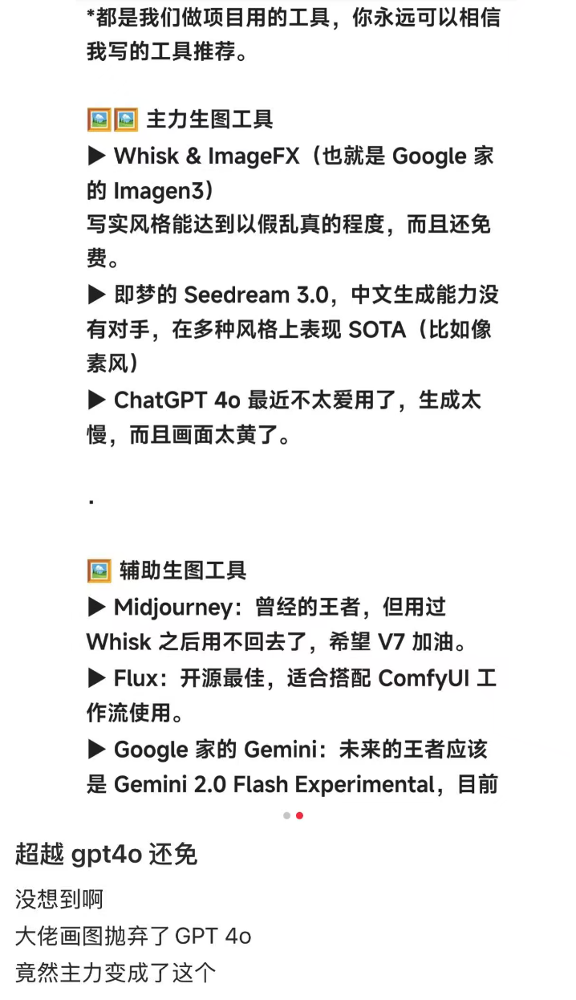

创世小玩家2 （或者说是精细风的minecraft， 人物模型不用cube堆叠版）

应该很容易找到技术解决方法和素材
自由度max
通用

一开始直接找3d模型来铺就行了
shader应该也容易
（直接找各种minecraft的原生或者模组资源，开源代码也有， 摄像机控制可以参考了，用在编辑器模式，unity3d工程的直接拿来参考也快）

后面ai训练改我要的风格贴图

参考游戏：
farm together

泰拉瑞亚

探索一下概念图
用ai结合把我想到的结合一下看看

2d，3d ai工具要改进一下

ai 模型：

https://aistudio.google.com/prompts/new_chat?model=gemini-2.5-flash-image-preview

